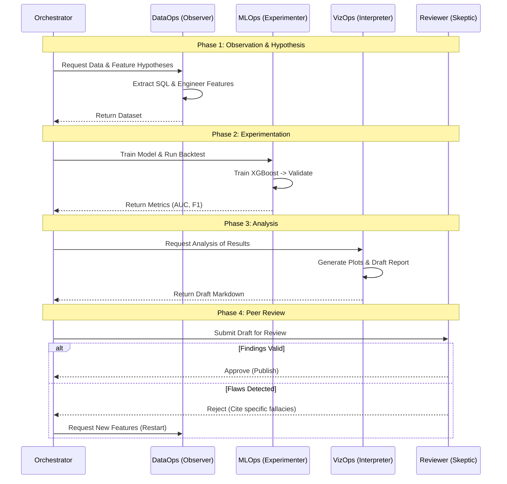
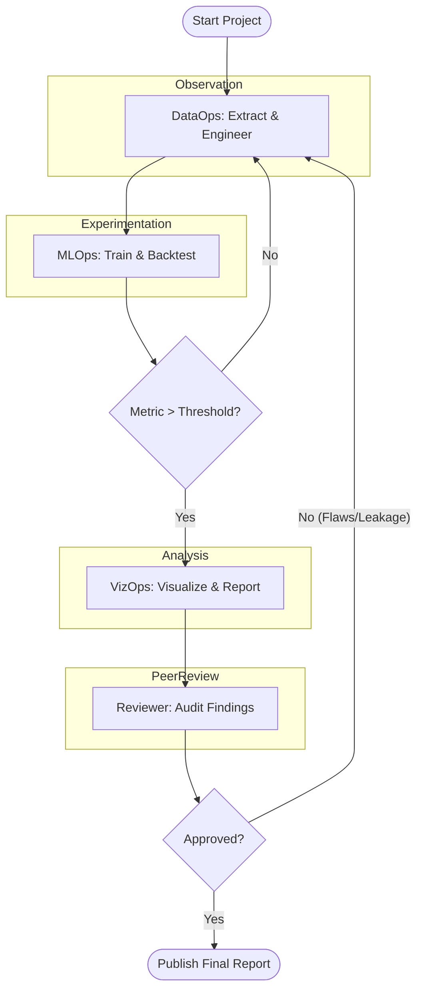

# Inpatient Readmission Risk

**Type:** Classification  
**Description:** This project evaluates 2 years worth of historical claims data to build a classification model. The goal is to predict the probability of a member being readmitted to an inpatient facility within 30 days of discharge.  
**Business Value:** Targeted discharge planning and follow-up to prevent readmissions.

## Architecture: The 4-Agent System

Inspired by scientific method, this architecture emphasizes rigorous observation, experimentation, and peer review.

1.  **Data & Feature Agent (`DataOps`) - *The Observer***
    *   **Role:** Observation & Hypothesis Generation.
    *   **Responsibilities:**
        *   Gather raw "facts" (claims data) from `fct_claim`.
        *   Formulate feature hypotheses (e.g., "Does length of stay correlate with readmission?").
        *   **Tools:** SQalchemy execution, schema validation.

2.  **Model & Evaluation Agent (`MLOps`) - *The Experimenter***
    *   **Role:** Controlled Experimentation.
    *   **Responsibilities:**
        *   Test hypotheses by training models (XGBoost, LightGBM).
        *   Conduct rigorous backtests to validate predictive power.
        *   **Tools:** Model fitting, cross-validation.

3.  **Reporting Agent (`VizOps`) - *The Interpreter***
    *   **Role:** Analysis & Inductive Reasoning.
    *   **Responsibilities:**
        *   Interpret experimental results.
        *   Visualize patterns (ROC, Lift Charts).
        *   Draft the initial findings report.
        *   **Tools:** `altair`.

4.  **Peer Review Agent (`Reviewer`) - *The Skeptic***
    *   **Role:** Peer Review & Falsification.
    *   **Responsibilities:**
        *   Critique the VizOps's findings for logical fallacies, overfitting, or data leakage.
        *   Reject results that lack statistical significance.
        *   Approve the final "Scientific Truth".
        *   **Tools:** Statistical tests, logic validation.

## Interaction Sequence

## Design Philosophy: Separation of Concerns

To build a robust system, we strictly separate deterministic execution from probabilistic reasoning.

### 1. Deterministic Layer
*   **Code:** Pure Python functions and SQL queries, @function_tools.
*   **Characteristics:** Reliable, repeatable, testable, fast.
*   **Responsibilities:**
    *   **Data Processing:** Fetching, cleaning, and transforming data (Pandas/SQL).
    *   **Computation:** Model training, scoring, and metric calculation (Scikit-Learn/XGBoost).
    *   **Visualization:** Rendering charts and graphs (Matplotlib).
*   **Constraint:** This layer *never* makes decisions; it only executes commands and returns facts.

### 2. Probabilistic Layer
*   **Agents:** LLM GPT-4o.
*   **Characteristics:** Creative, adaptive, reasoning-capable, "fuzzy".
*   **Responsibilities:**
    *   **Hypothesis:** "I suspect age is a factor." -> Calls `get_data(features=['age'])`.
    *   **Strategy:** "The model is overfitting." -> Calls `train_model(regularization=high)`.
    *   **Interpretation:** "The lift chart shows top decile performance." -> Writes report.
    *   **Critique:** "This correlation implies causation incorrectly." -> Rejects report.

### 3. The Bridge
*   **Tools:** Agents interact with the deterministic layer *only* via typed tools (`@function_tool`).
*   **Structured Output:** Agents communicate with each other *only* via Pydantic schemas, ensuring "fuzzy" thoughts are crystallized into structured data before passing to the next stage.

## Implementation Details

### Iterative Refinement
*   **Structured Output:** All inter-agent communication will use Pydantic models to enforce strict data contracts (JSON Schema).
*   **Iterative Refinement:** The `Reviewer` acts as a gatekeeper. If the `Reviewer` rejects the findings (e.g., "Potential target leakage detected"), the Orchestrator loops back to `DataOps` to refine the hypothesis.

### Tooling Strategy
*   **`@function_tool` Decorator:** Standardized decorator to expose Python functions as tools.
*   **Orchestration:** A main "Orchestrator" agent coordinates the scientific workflow.

### LangChain Integration
LangChain (specifically **LangGraph**) is utilized to manage the complex state and control flow between agents.

1.  **State Management (LangGraph):** The entire workflow is modeled as a state graph. The "State" object (containing the current dataset hash, model metrics, and report draft) is passed between nodes (agents). This allows for cyclic dependencies (e.g., Reviewer sending the process back to DataOps).
2.  **Structured Output Parsing:** We use LangChain's `PydanticOutputParser` to robustly coerce the "fuzzy" LLM thoughts into the strict Pydantic schemas required by the Bridge layer.
3.  **Tool Binding:** LangChain's `bind_tools` method is used to attach the deterministic Python functions to the OpenAI agent instances, handling the JSON schema conversion automatically.

### Audit Trail & Reproducibility
To ensure complete transparency and reproducibility, the system maintains a rigorous audit trail.

*   **Directory Structure:** All artifacts are saved in `output/`, nested by agent role (separation of concern).
    *   Example: `output/dataops/`, `output/mlops/`.
*   **Naming Convention:** All artifacts must follow the global step-based filename pattern `n_YYYYMMDD_HHMMSSNN[__name].ext` where:
  *   `n` is the zero-padded ordinal step of the overall process.
  *   `YYYYMMDD_HHMMSS` is a static run timestamp captured on first export.
  *   `NN` is a two-digit subsecond sequence derived from the step counter.
  *   Optional `__name` suffix can be added for clarity (e.g., `__roc_curve`).
  *   This enforces strict ordering and traceability across all agents.
*   **Data Versioning:** All intermediate datasets are saved as CSVs containing the content hash in the title.
*   **Thought Logs:** Every agent's reasoning process ("thoughts") must be captured and saved to the corresponding folder.

## Workflow: The Modern Scientific Method

1.  **Observation (`DataOps`):** The system observes raw historical data to identify potential patterns.
2.  **Hypothesis (`DataOps`):** Features are generated as specific hypotheses (e.g., "Patients with >3 comorbidities are higher risk").
3.  **Experiment (`MLOps`):** The model is trained and backtested. This is the "crucial instance" to test the hypothesis.
4.  **Analysis (`VizOps`):** Results are synthesized into a coherent narrative supported by visual evidence.
5.  **Peer Review (`Reviewer`):** The findings are subjected to rigorous scrutiny. Only robust, reproducible results are published.

## Agent Tool Inventory

Each agent has access to a strict set of deterministic tools.

### 1. DataOps Tools
*   `execute_sql(query: str) -> str`: Runs a SQL query against the warehouse and returns the path to the saved CSV result.
*   `get_table_schema(table_name: str) -> dict`: Returns column names and types for a given table.
*   `profile_dataset(file_path: str) -> dict`: Returns summary statistics (mean, null counts, cardinality) for a dataset.
*   `join_datasets(left_path: str, right_path: str, on: list, how: str) -> str`: Merges two datasets and returns the new file path.
*   `create_derived_feature(file_path: str, expression: str, new_col_name: str) -> str`: Adds a new column based on a pandas-compatible expression.

### 2. MLOps Tools
*   `split_data_time_series(file_path: str, date_col: str, cutoff_date: str) -> dict`: Splits data into train/test paths based on time.
*   `train_model(train_path: str, target: str, algorithm: str, params: dict) -> str`: Trains a model (XGBoost/LGBM) and returns the model artifact path.
*   `run_backtest(model_path: str, test_path: str) -> dict`: Generates predictions and returns a dictionary of metrics (AUC, F1, Precision, Recall).
*   `optimize_hyperparameters(train_path: str, target: str, n_trials: int) -> dict`: Runs an Optuna study and returns the best parameters.

### 3. VizOps Tools
*   `plot_roc_curve(model_path: str, test_path: str, output_dir: str) -> str`: Generates a ROC curve image and returns the path.
*   `plot_confusion_matrix(model_path: str, test_path: str, output_dir: str) -> str`: Generates a confusion matrix image.
*   `plot_feature_importance(model_path: str, output_dir: str) -> str`: Generates a feature importance bar chart.
*   `plot_calibration_curve(model_path: str, test_path: str, output_dir: str) -> str`: Generates a calibration plot to check probability reliability.

### 4. Reviewer Tools
*   `check_data_leakage(feature_list: list, target: str) -> list`: Scans feature names for suspicious terms (e.g., "future", "next_month") or high correlation with target.
*   `verify_time_split(train_start: str, train_end: str, test_start: str) -> bool`: Validates that the test set strictly follows the training set in time.
*   `validate_statistical_significance(metric_a: float, metric_b: float, n_samples: int) -> float`: Calculates p-value to ensure improvement is not noise.
*   `read_audit_log(step_id: str) -> str`: Retrieves the thought trace of a previous agent for logical auditing.

## Data Requirements
**Data Sources:** `fct_claim`
**Potential Features:**
- **Admission Details:** `ms_drg`, `major_service_category` (Inpatient), `length_of_stay` (derived).
- **Patient History:** Recent `diagnosis_code`, `comorbidities`.
**Target:** Readmission within 30 days (Binary).

## Evaluation Summary

**Strengths**
- Clear separation of deterministic tools and probabilistic agents with typed interfaces.
- Explicit peer review loop and audit trail for reproducibility.
- Time-aware workflow and tool inventory aligning with classification best practices.

**Risks & Gaps**
- Target definition needs formalization (index admission vs. all admissions; readmission window and exclusions).
- Potential target leakage from features computed post-discharge (e.g., future diagnoses, post-discharge claims).
- Time split validation must ensure patient-level leakage prevention (same patient across train/test in overlapping windows).
- Tool contracts lack input/output schemas and failure mode handling (empty results, schema drift).
- Metric threshold unspecified; business-aligned KPIs (PPV at top decile, calibration) not fully defined.
- Auditing “thought logs” may raise privacy/security concerns without redaction policy.

**Clarifications Needed**
- Data schema for `fct_claim` (required columns, date fields, patient identifiers).
- Exact feature windowing rules (lookback horizon, cutoff at discharge datetime).
- Target construction logic (SQL/pandas recipe, exclusions like planned readmissions).
- Versioning approach for tools/models (semver, content-hash, environment pinning).
- Statistical testing protocol (n, method, one/two-tailed, multiple comparisons control).

**Actionable Next Steps**
1. Define Pydantic schemas for tool I/O (datasets, models, metrics, plots).
2. Implement target construction and feature windowing as deterministic tools with unit tests.
3. Enforce patient-level and time-aware splits; add leakage checks for shared IDs across splits.
4. Add calibration and decision-curve analysis to VizOps tools; define business thresholds.
5. Specify audit policy (PII redaction, artifact retention).
6. 6. Add failure handling and retries in Orchestrator orchestration; log tool exceptions.
7. Pin environments (Python, libs), record git commit and data hash in every artifact.

## Additions to Implementation Details

- Dataset Contract:
  - Required columns: member_id, claim_id, admission_dt, discharge_dt, ms_drg, major_service_category, diagnosis_code, paid_amount.
  - Derived: length_of_stay = discharge_dt - admission_dt (days), comorbidity_count (Charlson-like proxy).
- Target Construction:
  - Readmission_30d = any inpatient admission within 30 days of index discharge for same member_id; exclude transfers and planned procedures (elective DRGs list).
- Split Policy:
  - Train/test split by discharge_dt with strict cutoff; exclude members with index in train and readmission in test within 30 days to prevent cross-window leakage.
- Metrics:
  - Report AUC, PR-AUC, calibration (ECE), PPV/Recall at operational thresholds, lift at top decile.
- Reviewer Criteria:
  - Reject if any feature has post-discharge timestamps or correlation >0.9 with target without justification; require p-value < 0.05 with adequate power.

## Compliance & Corrective Iteration

### Plan Adherence Monitoring
- Condition: If any agent (DataOps, MLOps, VizOps, Reviewer) disregards the documented plan (tool contracts, split policy, audit rules, logging policy), the system must:
  1. Log an ERROR with:
     - `agent`, `step_id`, `rule_violated`, `context`, `proposed_fix`
     - Persist to rotating `.log` per the Logging config.
  2. Perform a corrective self-evaluation before proceeding.

### Self-Evaluation Checklist (pre-correction)
- Verify:
  - Used only approved tools via `@function_tool` bridge.
  - Followed split policy (time-ordered, patient-level leakage prevention).
  - Respected data windowing (no post-discharge features).
  - Logging policy (progress bars to console, all else to `.log`).
  - Schema contracts (Pydantic models) validated.
- Outcome:
  - If any check fails, Orchestrator triggers a corrective iteration:
    - Roll back the step.
    - Re-run with compliant parameters.
    - Append an audit entry: `corrective_iteration=true`, include diffs of settings used.

### Orchestration Notes
- Orchestrator enforces the loop:
  - On ERROR, call Reviewer to validate the rule violation.
  - If confirmed, update state with corrective notes and re-dispatch to the originating agent.
- Logs:
  - Use `logging.file.level=INFO` with ERROR entries for violations; include `step_id` to tie artifacts and thought logs.

## Configuration & Logging

### Project-level YAML
- Single source of truth at `/home/garth/garage/classifier/config.yaml`.
- Supports per-agent sections, dataset paths, model params, thresholds, and output directories.
- Runtime overrides allowed via environment variables (e.g., `CONFIG__MLOPS__ALGORITHM`).

### Important Settings (documented)
- General:
  - `project.name`, `env`, `seed`
  - `output.root_dir`, `timestamp_format`
- Data:
  - `data.source_table`, `data.id_columns`, `data.datetime_columns`
  - `data.lookback_days`, `data.target_window_days`
  - `data.exclusions.planned_drgs`, `data.exclusions.transfer_codes`
- Splits:
  - `split.date_col`, `split.cutoff_date`, `split.patient_level_exclusion_window_days`
- Modeling:
  - `mlops.algorithm`, `mlops.params`, `mlops.optimize.n_trials`
- Metrics & Thresholds:
  - `metrics.thresholds.operational_ppv_target`, `metrics.report_top_decile`
- Logging:
  - `logging.console.progress_bars=true` (progress bars only)
  - `logging.file.path`, `logging.file.level`, `logging.file.rotate.max_bytes`, `logging.file.rotate.backup_count`
- Audit:
  - `audit.redact_pii=true`, `audit.retain_days`

### Progress Bars & Logging Policy
- Console: show progress bars only (e.g., feature engineering steps, training epochs, backtest runs).
- File logging: write all INFO/DEBUG/WARN/ERROR to rotating `.log` files under `output/<agent>/`.
- Each artifact includes timestamp, git commit, data hash; logs use the same step id.

### Integration Notes
- Orchestrator loads `config.yaml` at start; passes relevant subsections to agents.
- Agents initialize logging handlers:
  - Console handler filtered to progress events.
  - Rotating file handler for full logs.
- Tools read settings from config (e.g., split cutoff, exclusions) and emit progress events.
